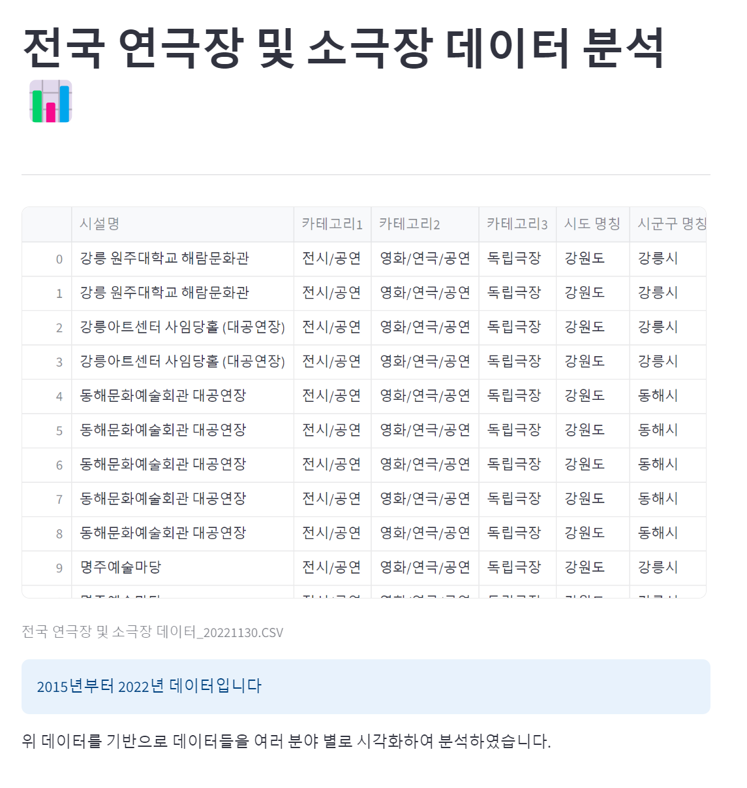
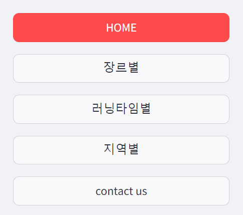
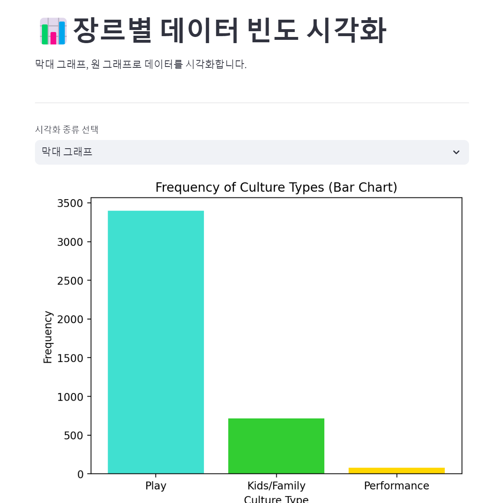
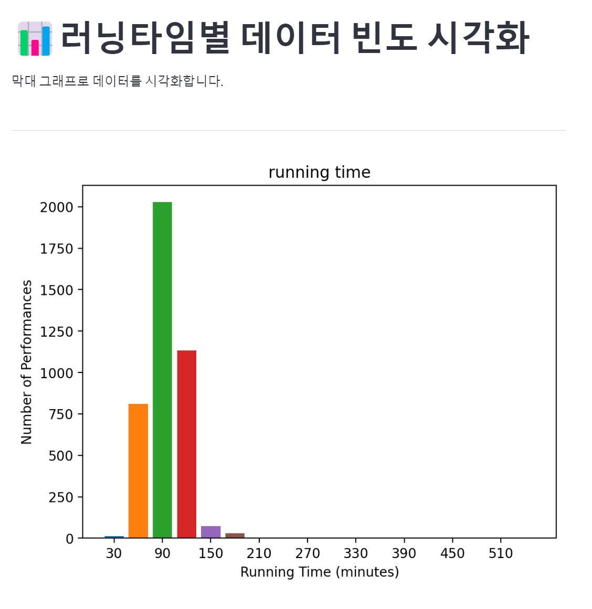
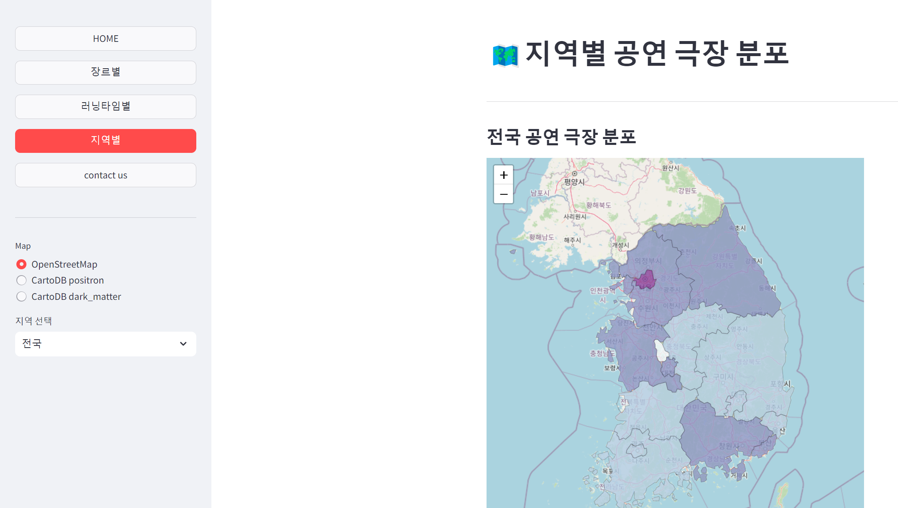
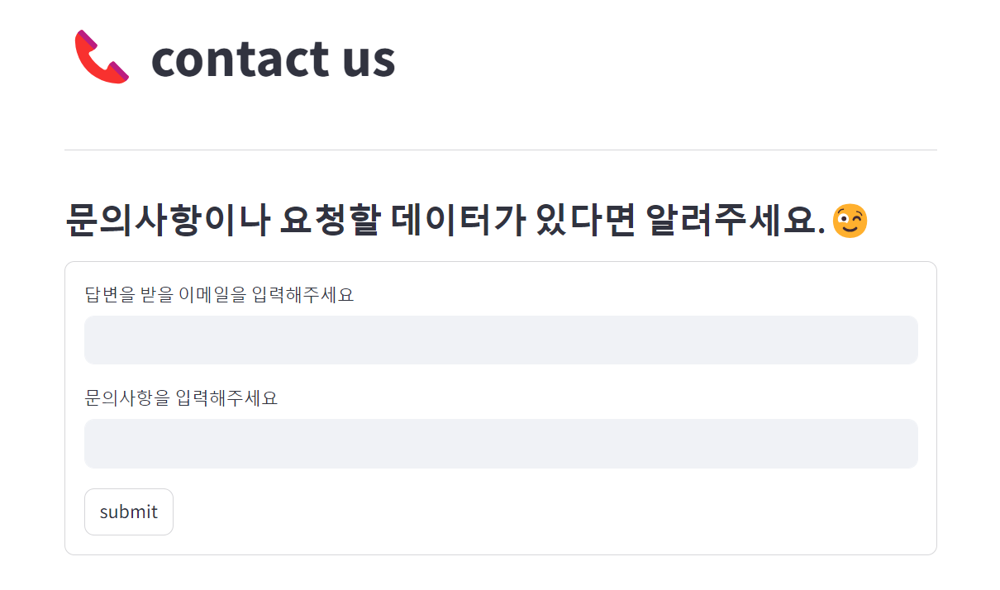

# 공연 데이터 분석 대시보드

## 메인페이지
- 어떤 대시보드인지 알 수 있게 설명
- 사용 데이터

- 사이드바(메이페이지, 장르별, 러닝타임별, 지역별, contact us)

## 장르별 
- 장르별(연극,어린이/가족 등등) 
어떤 장르가 주로 공연되는지, 어떤 장르들이 있는지 알아보기 위해 시각화
- 시각화하는 그래프를 선택지를 줄 수 있게 막대그래프 원 그래프 2가지로 만듦

## 러닝타임별
- 러닝타임별 막대그래프
if 내가 공연을 처음보러가는사람:
 내가 보는 공연이 너무 긴거 같은데 평균적으로 러닝타임이 어떻게 되나? 오 나는 긴편은 아니구나 
if 내가 공연관계자라면:
 내가 실험적인 공연을 하고 싶은데 최대 러닝타임이 어느정도까지 였는지 이 정도면 괜찮을지 오 최대 러닝타임으 530분까지 있었네,, 400분 정도면 괜찮겠다
- 막대그래프로 30분 간격으로 잘라 표현

## 지역별 
- 공연극장분포(전국, 서울)
주로 어디에서 공연되는지, 내가 공연을 열고싶은데 어디에서 주로 많이 공연되나, 주로 공연이 많이 된다는 건 어느정도 관객을 모을 수 있다는 걸 의미하겠지?
전국 중에서도 서울이 압도적으로 공연이 많이 돼 서울 지도도 포함(전국, 서울 선택 가능)
- geojson

## contact us
- 문의사항과 답변할 이메일 받기
문의사항이나 요청할 데이터를 받아 페이지를 업데이트하거나 문의에 대한 답변을 할 수 있도록 함.
더 좋은 페이지를 만들기 위해서는 피드백이 필요할 것 같아 이 페이지를 만듦.
- 받은 문의 내용을 contact.txt 파일에 딕셔너리 형태로 정리
